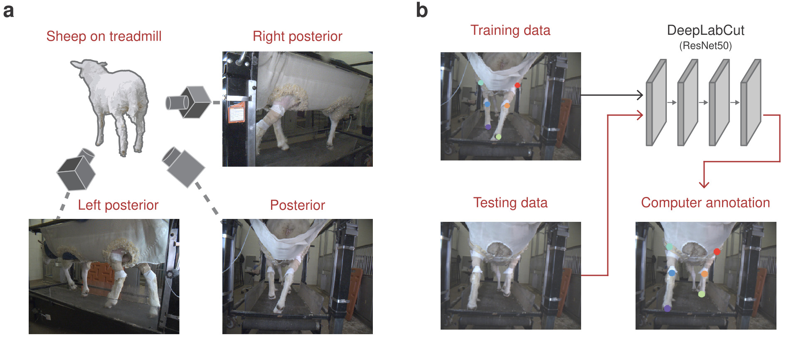

# DeepLabCut_Manuscript
## Recognition of Animal Body Parts via Supervised Learning

In this study, we hypothesized that machine learning supervised with adequate human annotations would be able to accurately predict body parts from video sequences. To generate machine annotations, we employed the state-of-the-art pose-estimating library, DeepLabCut, which was trained using frames annotated by human annotators. Notably, the machine learning algorithm  generated accurate predictions, with errors comparable to those between humans. We also observed that abnormal annotations with a high error could be revised by introducing Kalman Filtering, which interpolates the trajectory of body parts over the time series, enhancing robustness. Our results suggest that conventional transfer learning methods can generate behavior annotations as accurate as those made by humans, presenting great potential for further research.

#### Citation
Kreiman B, Jang J, Govindarajan L, Serre T. Recognition of animal body parts via supervised learning. Journal of Emerging Investigators (2023), Vol. 6, [doi.org/10.59720/23-109](https://emerginginvestigators.org/articles/23-109)
